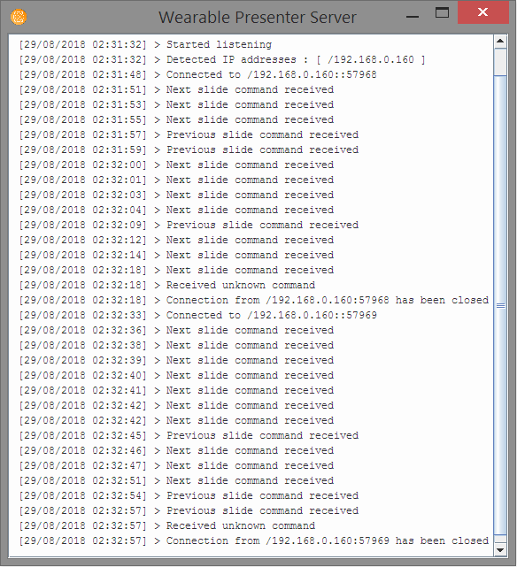
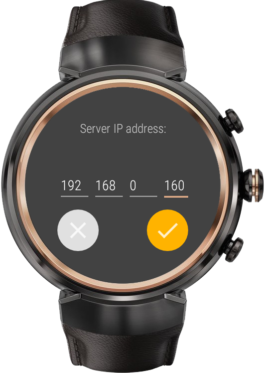
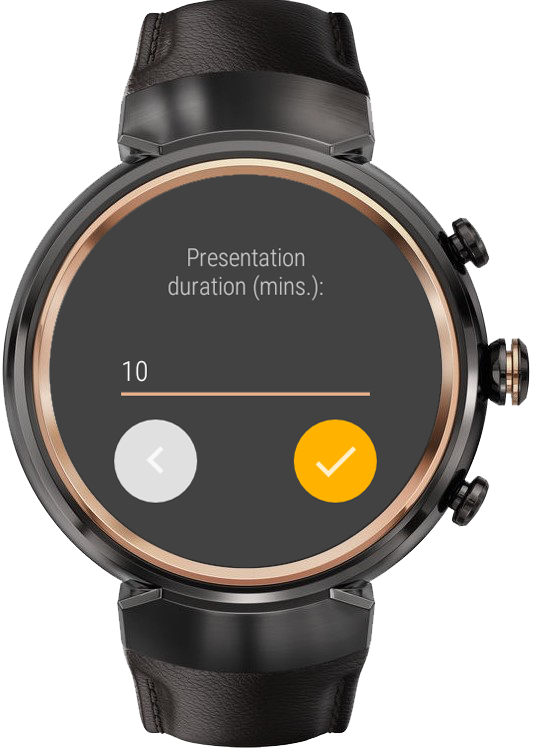
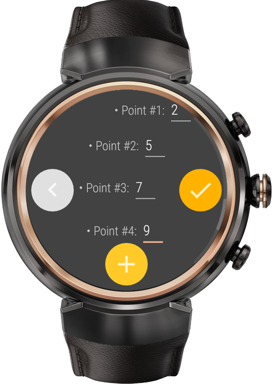
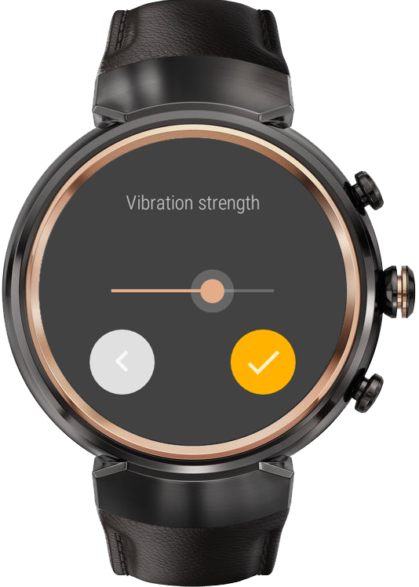
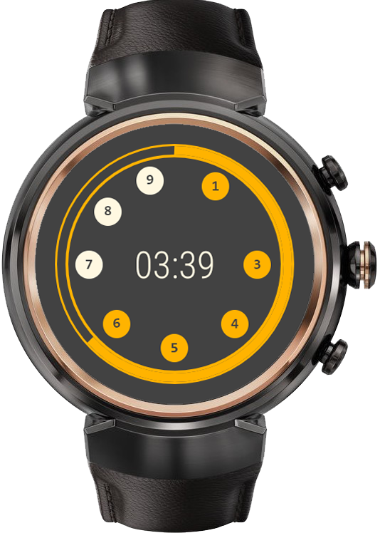

# Wearable Presenter
> Built by Farid Arbai
>> [Project's Website](www.faridarbai.com/wearable-presenter)

Wereable Presenter is a presentation controller for wearable devices that run Android Wear OS, designed to take control of every single aspect regarding a presentation: from slides management to scheduled notifications. This project was implemented with the sole purpose of vanishing the need of manual pointers, therefore enhancing body language through the freedom of hands.

The implemented functionalities are the following:
* **Connection through wifi** to the PC that hosts the presentation.
* **Slides management**, allowing to move forward and backwards through the presentation.
* **Scheduled vibrating notifications** so that the user can set certain timeouts and the watch will silently vibrate passed those deadlines, therefore allowing remaining time control without even looking at the watch.
* **Multiplatform management**, supporting any OS in the PC that hosts the presentation (Windows, MAC, Linux, ChromeOS, etc) as well as any presentation platform (PowerPoint, Keynote, Adobe Acrobat Reader, Prezi, etc).

# Tutorial
### 1. Launch the server
Execute the server on your desktop and take note of the displayed IP address. This server will be in charge of receiving your device's commands and act upon them.

### 2. Connect to the server
Type the server's displayed IP address into your wearable device and as soon it connects it will take you to the next step.

### 3. Set up the duration
Enter the expected time that your presentation will take. You will have a countdown on this time and also you'll be able to set up various notification points allong that time in the next step.

### 4. Choose your notification points
Enter the points on which you would like to get notified in order to be aware of the remianing time. For example, we chose to be notified at minutes number 2, 5, 7 and 9 in the example bellow.

### 5. Set the notification strength
Slide the displayed bar to modulate notification vibration strength depending on how sensitive you are. From 75% and above, all notifications are haptic and therefore silent.

### 6. Control your presentation
Tap once into the screen to move forward through the presentation or double-tap in order to go back to the previous slide. If you would like to exit the presentation mode at any time, just keep the screen pressed and it'll take you to the previous set up screen.

# Install
You can find both the wearable app and the desktop controller on the [project's website](http://www.faridarbai.com/wearable-presenter)

